```{r setup, include=FALSE}
options(width=70)
knitr::opts_chunk$set(comment = "##", warning = FALSE, message = FALSE,
                      echo = TRUE, tidy = FALSE, size="small")
```

## 

- QGIS es un Sistema de Información Geográfica (SIG) de Código Abierto licenciado bajo GNU - General Public License.  
- QGIS es un proyecto oficial de Open Source Geospatial Foundation (OSGeo).  
- QGIS corre sobre Linux, Unix, Mac OSX, Windows y Android.  
- QGIS soporta numerosos formatos y funcionalidades de datos vector, datos ráster y bases de datos.  
- QGIS es el SIG Líder de Código Abierto para Escritorio.  
- La versión actual es QGIS 2.18.13 'Las Palmas' y fue lanzada el 15.09.2017.  

http://www.qgis.org


## QGIS - Inicio: proyectos recientes


## QGIS - Vistazo
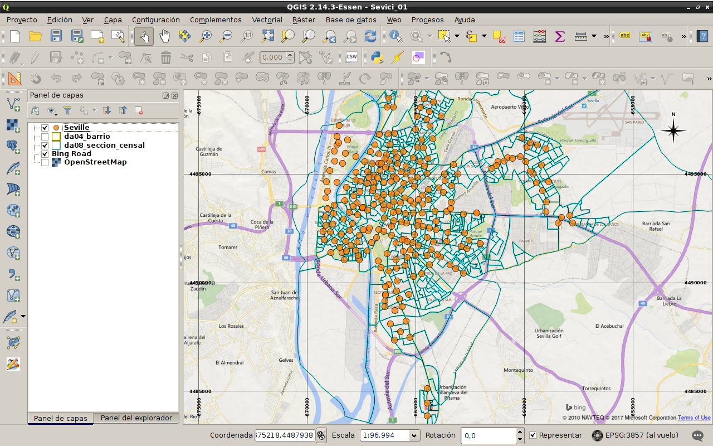

## QGIS - Menú -> Procesos 
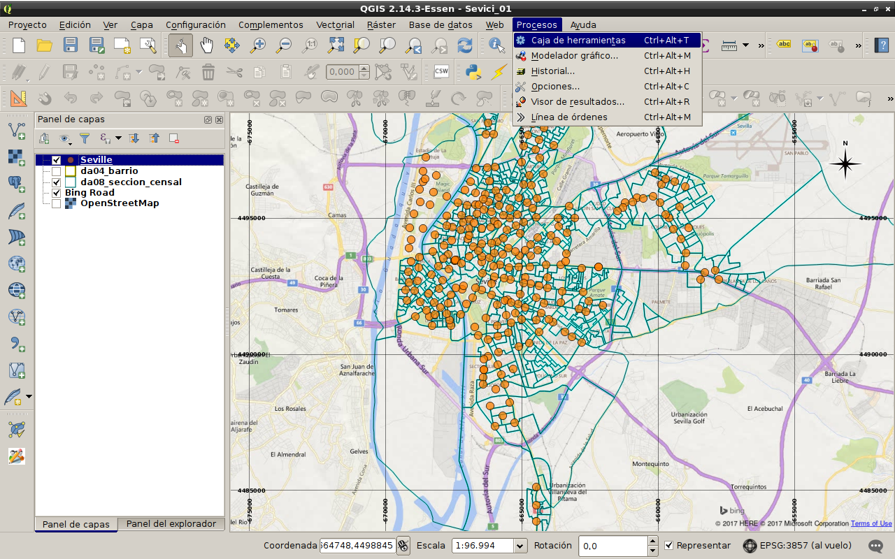

## QGIS - Herramientas de procesado
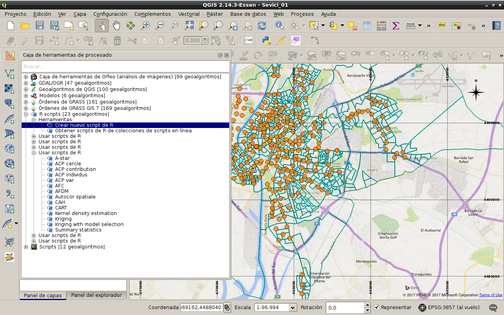

## R Scripts -> Editor
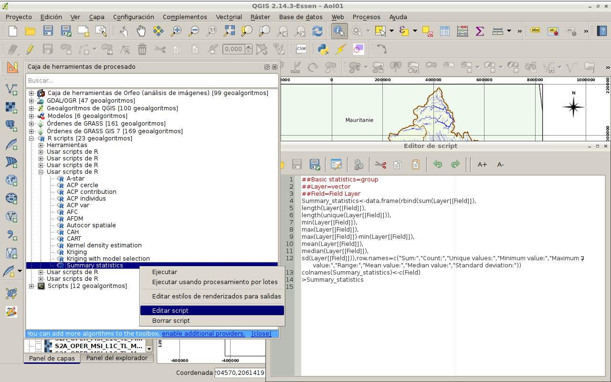

## R Scripts -> Ejecutar
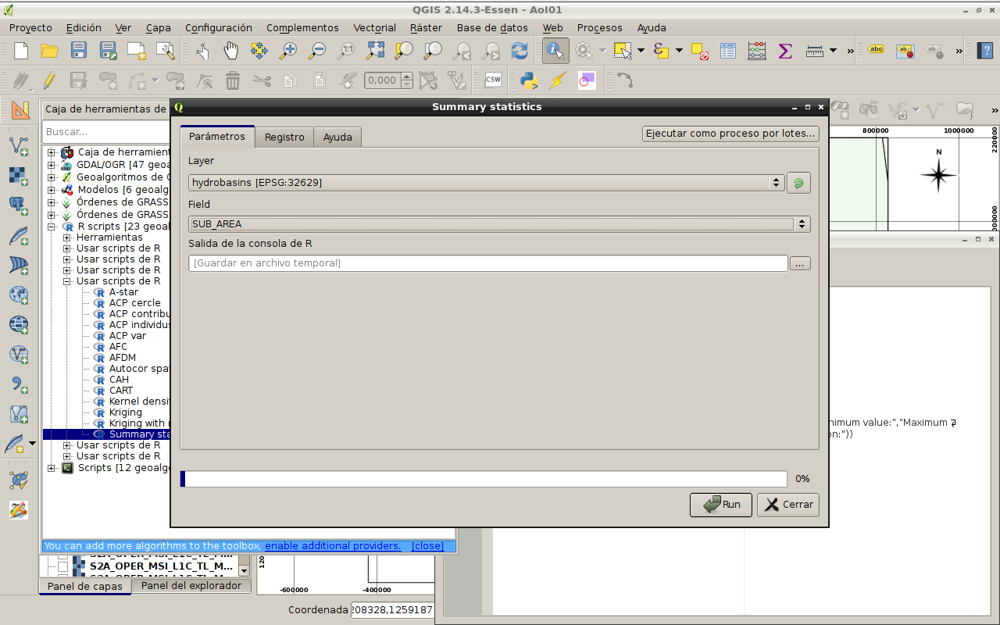

## R Scripts -> Resultados
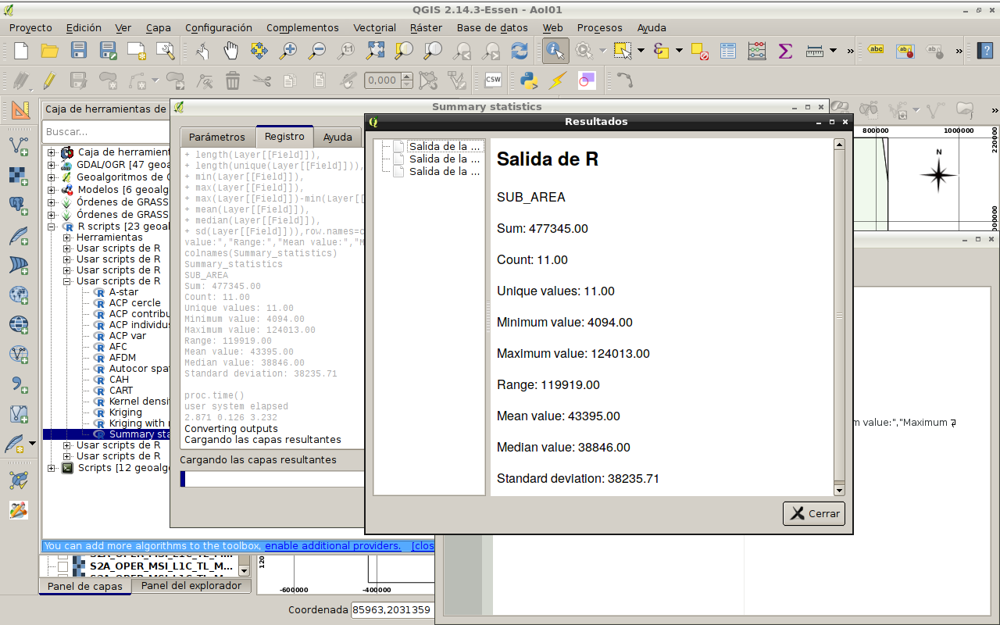

## R Scripts -> Ayuda
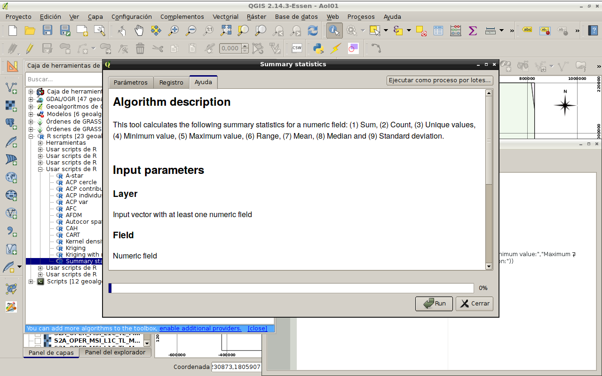

## R Scripts -> Colecciones en línea
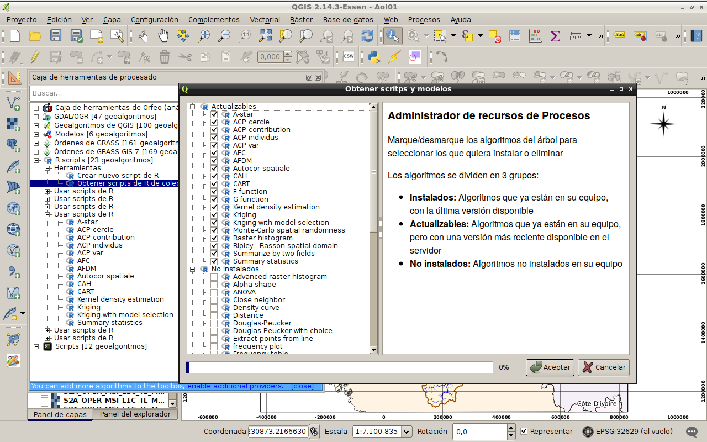
https://github.com/qgis/QGIS-Processing

## QGIS - Menú -> Procesos -> Opciones
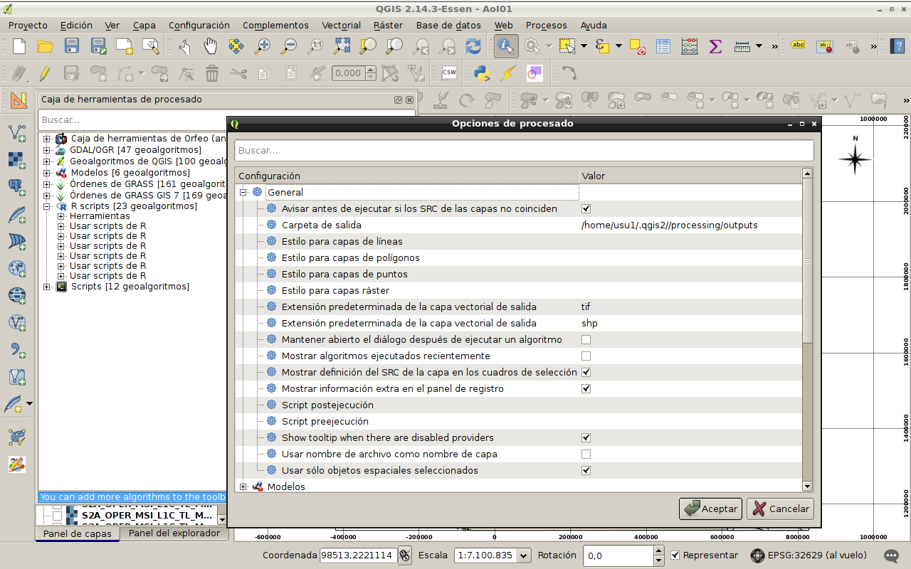

## QGIS - Menú -> Procesos -> Opciones R
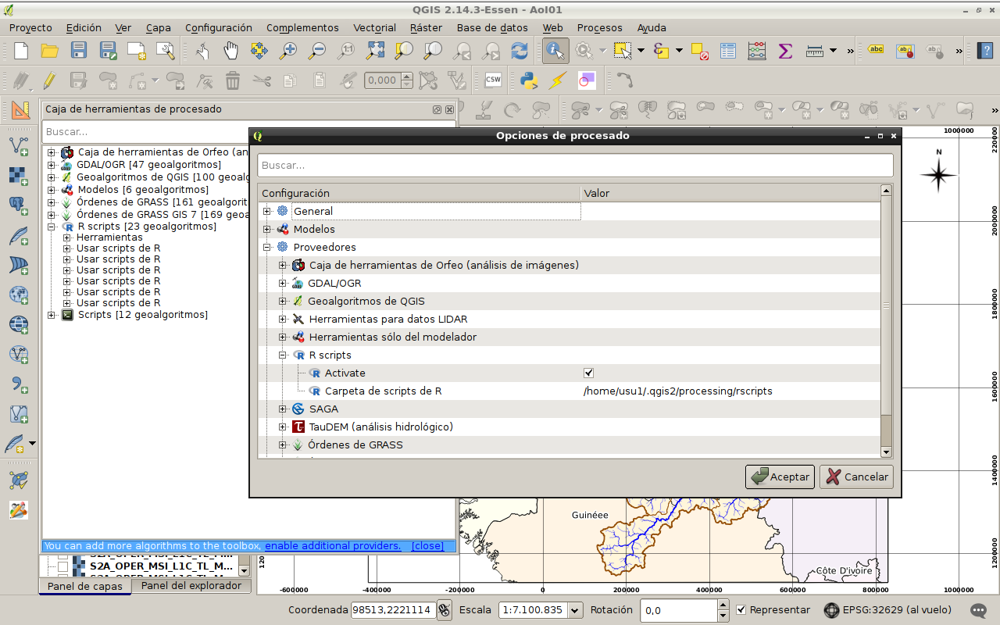

## QGIS - R: Requerimientos
- _R instalado_ con al menos las siguientes librerías:   
      **sp, rgdal, maptools, raster**

- _QGIS instalado_ con el Complemento **Processing activado**   
      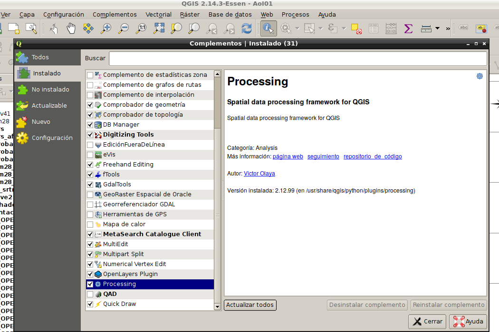

## R Scripts: Arquitectura y Sintaxis (1/2)
**Cabecera de Script con Parámetros.**  
 Las líneas de cabecera deben comenzar con ##. La primera hace referencia al **grupo** en que se encuadra el script
```{r eval = FALSE}
##Geoestadística=group
```
 La sintaxis de los **_parámetros de entrada_** es:
```{bash eval = FALSE}
<input_param>::='##'<param>=[optional] <input_type> [<default>]<EOL>
<input_type>::= (boolean | number | [long]string | file | folder |
        extent | crs | [multiple] vector [point|line|polygon] |
        [multiple] raster | table | field <parent_param> |
        selection <option>(";"<option>)+)
Ejemplos:
##Capa=vector polygon
##Area=field Capa 
##Modelo=optional selection exacto;aproximado 
```

## R Scripts: Arquitectura y Sintaxis (2/2)
 La sintaxis de los **_parámetros de salida_** es:
```{bash eval = FALSE}
<output_param>::='##'<param>=(output) <output_type> <EOL>
<output_type>::= (vector | raster | table)
Por ejemplo: ##output raster
```
 Los **_parámetros de configuración_** son:
```{bash eval = FALSE}
##showplots     # Muestra salida de plots
##usereadgdal   # Usa rgdal en vez de brick al abrir vectoriales
##passfilenames # Lee desde el fichero en disco, no la capa QGIS
```
**Cuerpo de Script**   
Es el código en R haciendo uso de los parámetros, con una única salvedad: Una línea que se inicia con **>** indica que lo que le sigue,
se debe enviar al visor de resultados de QGIS.

## R Scripts: Ejemplo - Auto-Kriging (1) 
```{r eval = FALSE}
##geostatistics=group
##CapaVec=vector
##Campo=field CapaVec
##SalidaPred=output raster
##SalidaDesv=output raster
##showplots
require("automap")
require("sp")
require("raster")
require("gstat")
```

## R Scripts: Ejemplo - Auto-Kriging (2) 
```{r eval = FALSE}
table=as.data.frame(CapaVec)
coordinates(table)= ~coords.x1+coords.x2
c = CapaVec[[Campo]]
# set.seed(12345)
# x=rnorm(100,100,1)
# y=rnorm(100,100,1)
# c=rnorm(100,1000,500)
# table=data.frame(x,y,c)
# coordinates(table)=~x+y
```

## R Scripts: Ejemplo - Auto-Kriging (3) 
```{r eval = FALSE}
kg_result = autoKrige(c~1, table)
Prediction = raster(kg_result$krige_output,1)
stdDev = raster(kg_result$krige_output,3)
SalidaPred<-Prediction
SalidaDesv<-stdDev

#kg_result$var_model
>kg_result$var_model

modelo = tail(kg_result$var_model,1)
m = fit.variogram(kg_result$exp_var, 
                  vgm(modelo$psill, modelo$model,
                      modelo$range, modelo$kappa))
plot(kg_result$exp_var, m, main=as.character(modelo$model))

```

## R Scripts: Ejemplo - Auto-Kriging (4)


## R Scripts: Ejemplo - Auto-Kriging (5)
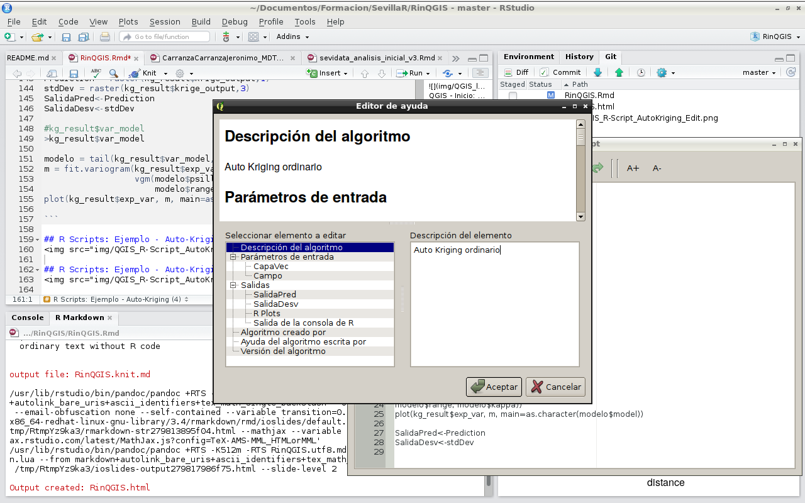

## R Scripts: Ejemplo - Auto-Kriging (6)
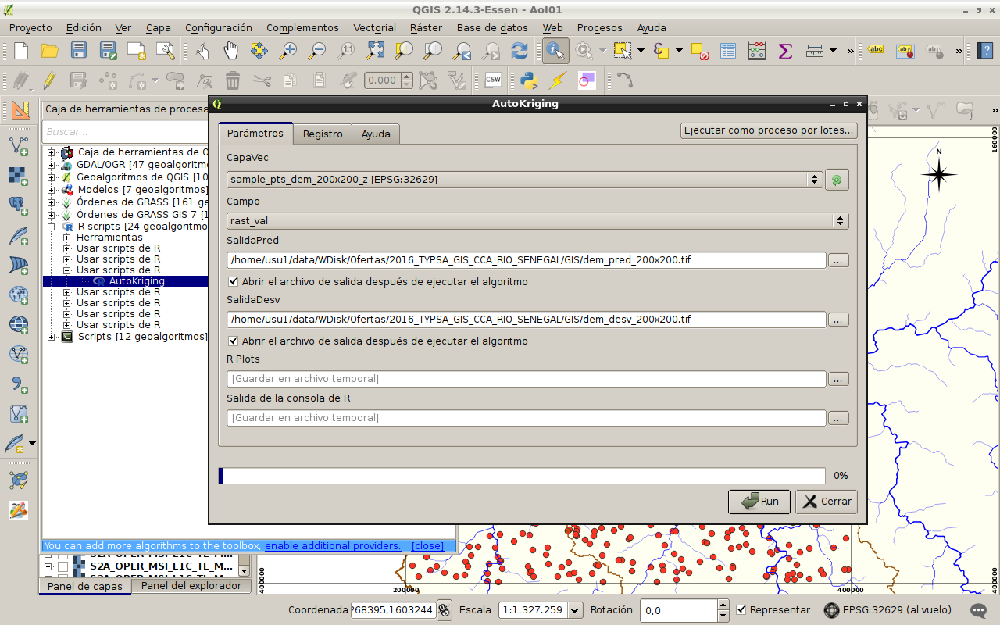

## R Scripts: Ejemplo - Auto-Kriging (7)
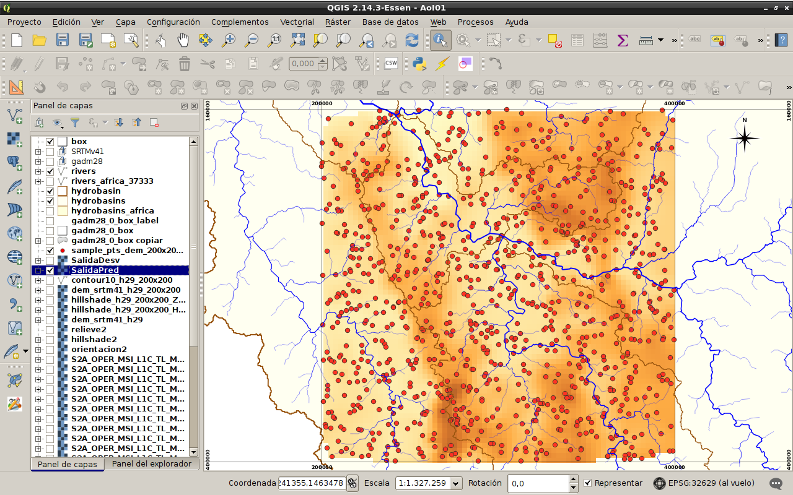

## R Scripts: Ejemplo - Auto-Kriging (8)
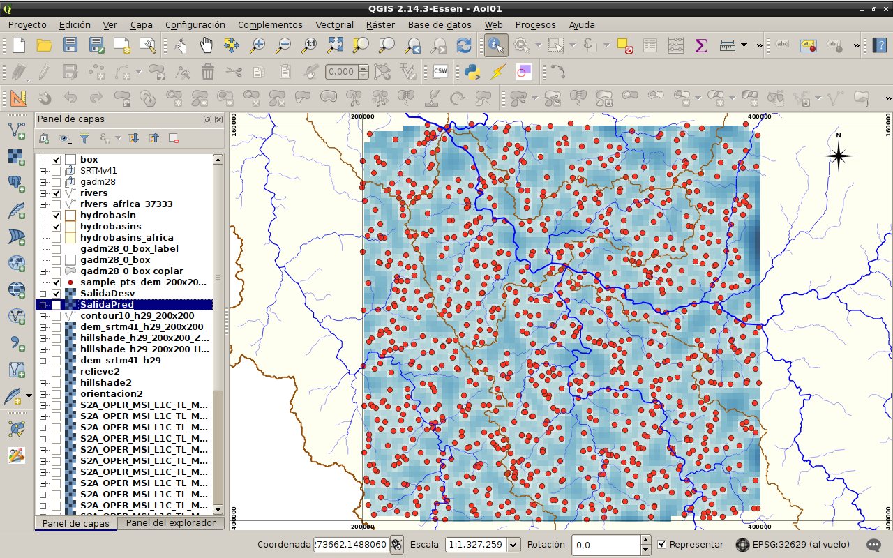

## R Scripts: Ejemplo - Auto-Kriging (9)
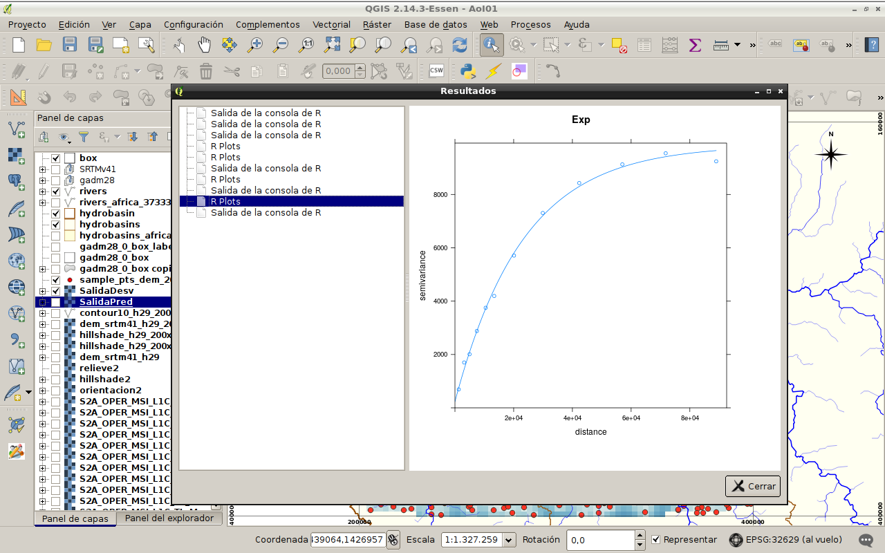

## Referencias

- [User Manual - processing](http://docs.qgis.org/2.18/es/docs/user_manual/processing/3rdParty.html#r-creating-r-scripts)

- [Calling the SpatialPosition package from within QGIS.](https://cran.r-project.org/web/packages/SpatialPosition/vignettes/QGISInterface.html)

- [ANÁLISIS ESTADÍSTICO DE DATOS ESPACIALES CON QGIS Y R](https://books.google.es/books?isbn=8436270916)

- [Image Classification with RandomForests in R (and QGIS)](https://www.linkedin.com/pulse/image-classification-randomforests-r-qgis-ali-santacruz)


# Fin, Gracias.

