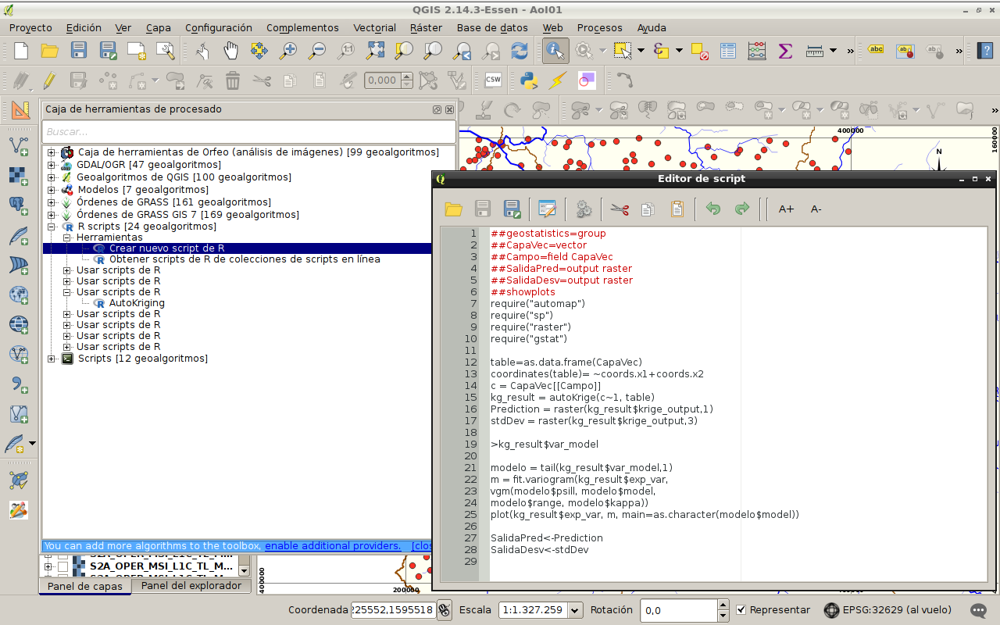

```{r setup, include=FALSE}
options(width=70)
knitr::opts_chunk$set(comment = "##", warning = FALSE, message = FALSE,
                      echo = TRUE, tidy = FALSE, size="small")
```

## 

- QGIS es un Sistema de Información Geográfica (SIG) de Código Abierto licenciado bajo GNU - General Public License.  
- QGIS es un proyecto oficial de Open Source Geospatial Foundation (OSGeo).  
- QGIS corre sobre Linux, Unix, Mac OSX, Windows y Android.  
- QGIS soporta numerosos formatos y funcionalidades de datos vector, datos ráster y bases de datos.  
- QGIS es el SIG Líder de Código Abierto para Escritorio.  
- La versión actual es QGIS 2.18.13 'Las Palmas' y fue lanzada el 15.09.2017.  

http://www.qgis.org


## QGIS - Inicio: proyectos recientes


## QGIS - Vistazo


## QGIS - Menú -> Procesos 


## QGIS - Herramientas de procesado


## R Scripts -> Editor


## R Scripts -> Ejecutar


## R Scripts -> Resultados


## R Scripts -> Ayuda


## R Scripts -> Colecciones en línea


## QGIS - Menú -> Procesos -> Opciones


## QGIS - Menú -> Procesos -> Opciones R


## QGIS - R: Requerimientos
- _R instalado_ con al menos las siguientes librerías:   
      **sp, rgdal, maptools, raster**

- _QGIS instalado_ con el Complemento **Processing activado**   
      

## R Scripts: Arquitectura y Sintaxis (1/2)

```{r}
# #####################################################
# Cabecera con Parámetros de Entrada y Salida
# #####################################################

##Grupo en que se encuadra el script: group
##In1: boolean True
##In2: number 1
##In3: string
##In4: extent
##In5: file
##In6: folder
##In7: vector [point, line, polygon]
##In8: raster
##In9: table
##InA: field {layer}
##InB: selection op1;op2;op3;op4
```

## R Scripts: Arquitectura y Sintaxis (2/2)

```{r}
##Out1: output {boolean[, ... vector, raster, ...]}
##showplots     # Muestra salida de plots
##usereadgdal   # Usa rgdal en vez de brick al abrir vectoriales
##passfilenames # Lee desde el fichero en disco, no la capa QGIS

# ###################################################################
# Cuerpo de Script: Código R haciendo uso de los parámetros
# ###################################################################
#library(sp)
#library(maptools)

# ...

#> X 
#Una línea que se inicia con > indica que lo que le sigue, X, 
# se debe enviar al visor de resultados 
#

```

## R Scripts: Ejemplo - Auto-Kriging (1) 
```{r eval = FALSE}
##geostatistics=group
##CapaVec=vector
##Campo=field CapaVec
##SalidaPred=output raster
##SalidaDesv=output raster
##showplots
require("automap")
require("sp")
require("raster")
require("gstat")
```

## R Scripts: Ejemplo - Auto-Kriging (2) 
```{r eval = FALSE}
table=as.data.frame(CapaVec)
coordinates(table)= ~coords.x1+coords.x2
c = CapaVec[[Campo]]
# set.seed(12345)
# x=rnorm(100,100,1)
# y=rnorm(100,100,1)
# c=rnorm(100,1000,500)
# table=data.frame(x,y,c)
# coordinates(table)=~x+y
```

## R Scripts: Ejemplo - Auto-Kriging (3) 
```{r eval = FALSE}
kg_result = autoKrige(c~1, table)
Prediction = raster(kg_result$krige_output,1)
stdDev = raster(kg_result$krige_output,3)
SalidaPred<-Prediction
SalidaDesv<-stdDev

#kg_result$var_model
>kg_result$var_model

modelo = tail(kg_result$var_model,1)
m = fit.variogram(kg_result$exp_var, 
                  vgm(modelo$psill, modelo$model,
                      modelo$range, modelo$kappa))
plot(kg_result$exp_var, m, main=as.character(modelo$model))

```

## R Scripts: Ejemplo - Auto-Kriging (4)


## R Scripts: Ejemplo - Auto-Kriging (5)


## R Scripts: Ejemplo - Auto-Kriging (6)


## R Scripts: Ejemplo - Auto-Kriging (7)


## R Scripts: Ejemplo - Auto-Kriging (8)


## R Scripts: Ejemplo - Auto-Kriging (9)


## Referencias

- [User Manual - processing](http://docs.qgis.org/2.18/es/docs/user_manual/processing/3rdParty.html#r-creating-r-scripts)

- [Calling the SpatialPosition package from within QGIS.](https://cran.r-project.org/web/packages/SpatialPosition/vignettes/QGISInterface.html)

- [ANÁLISIS ESTADÍSTICO DE DATOS ESPACIALES CON QGIS Y R](https://books.google.es/books?isbn=8436270916)

- [Image Classification with RandomForests in R (and QGIS)](https://www.linkedin.com/pulse/image-classification-randomforests-r-qgis-ali-santacruz)


# Fin, Gracias.

