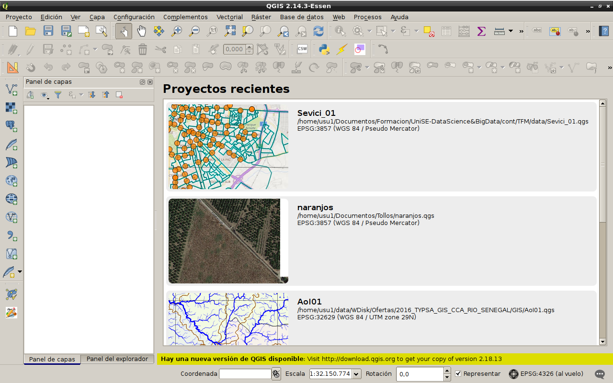

```{r setup, include=FALSE}
knitr::opts_chunk$set(echo = TRUE)
```

## 

- QGIS es un Sistema de Información Geográfica (SIG) de Código Abierto licenciado bajo GNU - General Public License.  
- QGIS es un proyecto oficial de Open Source Geospatial Foundation (OSGeo).  
- QGIS corre sobre Linux, Unix, Mac OSX, Windows y Android.  
- QGIS soporta numerosos formatos y funcionalidades de datos vector, datos ráster y bases de datos.  
- QGIS es el SIG Líder de Código Abierto para Escritorio.  
- La versión actual es QGIS 2.18.13 'Las Palmas' y fue lanzada el 15.09.2017.  

http://www.qgis.org


## QGIS - Inicio: proyectos recientes


## QGIS - Vistazo


## QGIS - Menú -> Procesos 


## QGIS - Herramientas de procesado


## R Scripts -> Editor


## R Scripts -> Ejecutar


## R Scripts -> Resultados


## R Scripts -> Ayuda


## R Scripts -> Colecciones en línea


## QGIS - Menú -> Procesos -> Opciones


## QGIS - Menú -> Procesos -> Opciones R


## QGIS - R: Requerimientos
- _R instalado_ con al menos las siguientes librerías:   
      **sp, rgdal, maptools, raster**

- _QGIS instalado_ con el Complemento **Processing activado**   
      

## R Scripts: Arquitectura (1/2)

```{r}
# #####################################################
# ######### Cabecera con Parámetros de Entrada y Salida
# #####################################################
## Grupo en que se encuadra el script: group
## In1: boolean True
## In2: number 1
## In3: string
## In4: extent
## In5: file
## In6: vector [point, line, polygon]
## In7: raster
## In8: table
## In9: field layer
## InA: selection op1;op2;op3;op4
## showplots
## Out1: output {boolean[, ... vector, raster, ...]}

```

## R Scripts: Arquitectura (2/2)

```{r}
# ###################################################################
# ######### Cuerpo de Script: Código R haciendo uso de los parámetros
# ###################################################################
#library(sp)
#library(maptools)

# ...

#> X 
#Una línea que se inicia con > indica que lo que le sigue, X, 
# se debe enviar al visor de resultados 
#

```
